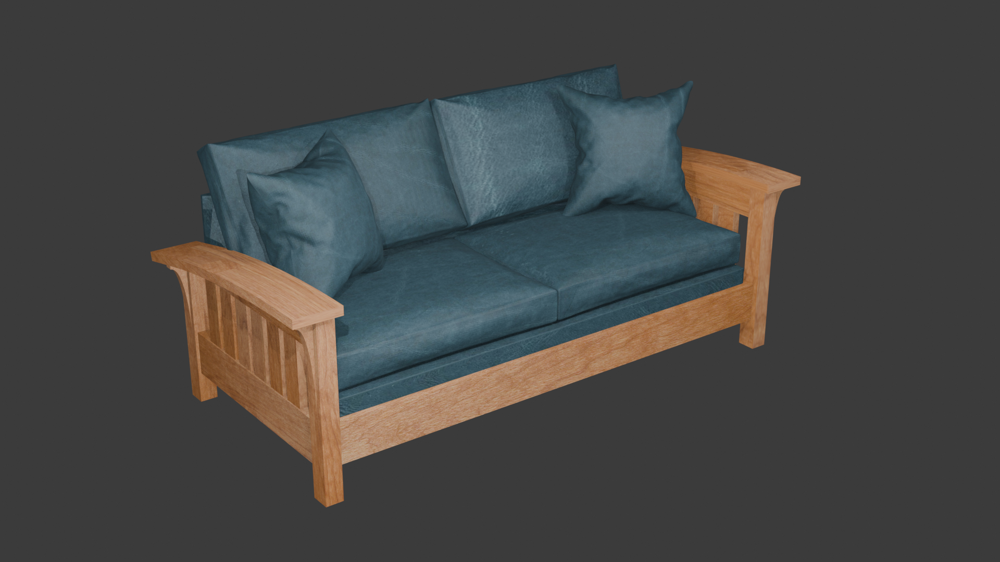
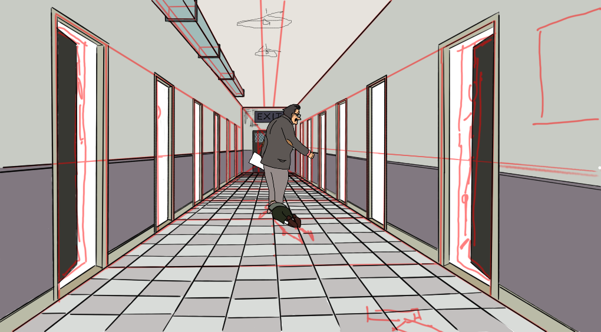
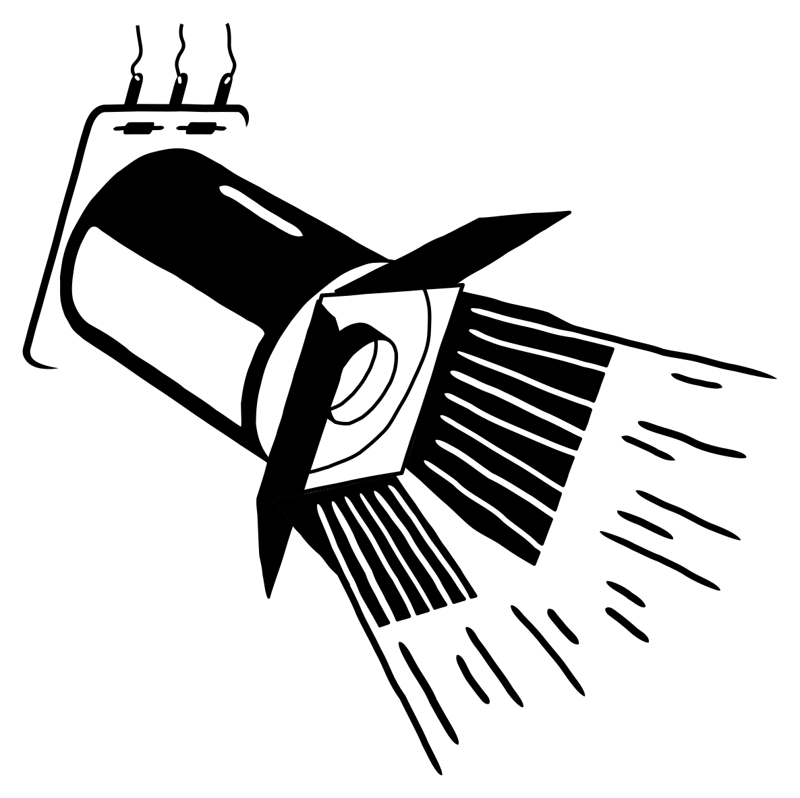
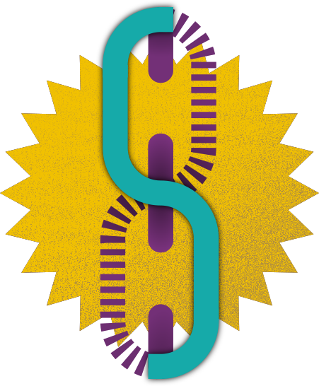
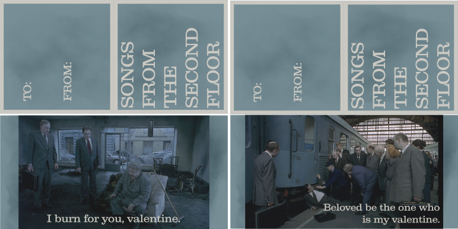
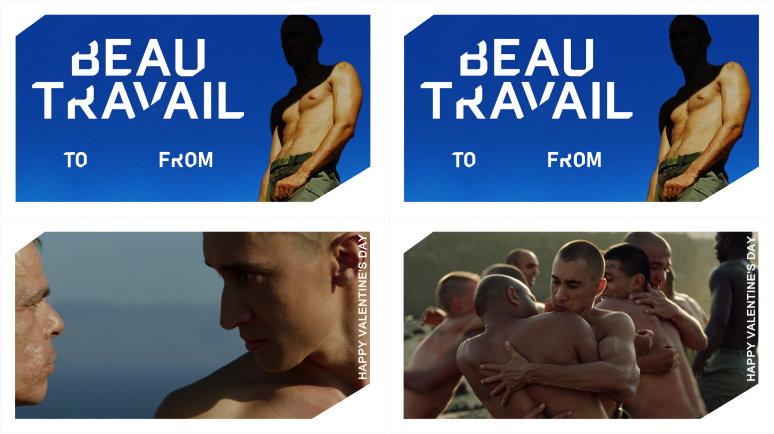
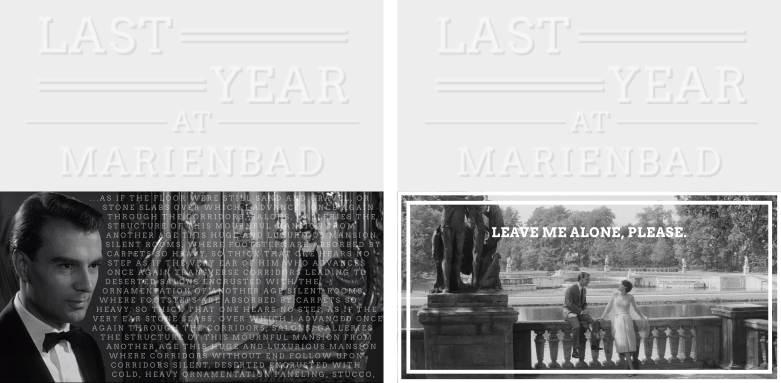

# Writing

When Inkle games was working on Pendragon, they put out a call for short stories to be campfire tales in the game. Mine didn't get selected, but I'm quite proud of it.

```{=html}
<iframe width="780" height="500" src="https://lqsullivan.itch.io/a-spell" title="A Spell"></iframe> 
```

# Pinball DMD art

I love the look of pinball DMD animations so now and then I try to make some myself in Aseprite. It's tough cause not only do I not have a background in drawing, this is highly constrained (128x32 canvas and 2 bit color).

I'd like to spend more time on this, but pixels are sharp compared to the actual plasma dots on those old displays, like how SNES games were made for CRT displays and don't look the same on modern LCD screens. Someday I'd like to make an Aseprite extension to display something closer to the hardware (or just a use an LED matrix).

### The Third Man

My parents are big noir fans and I've only seen a few, but I thought the high contrast of that style in black and white might make for a good DMD animation. I'd like to try more of these, but the aspec ratio is challenging, you either have to crop stuff out or extend the borders, here I could do that without thinking.

{fig-align="center" width="384"}

There are some things I like about this, but mostly I think it's a miss. Maybe it would work better on an actual DMD, cause when I squint it looks much better.

### Beau Travail

I always find it fun to think about pinball licenses that didn't happen or never could have happened. I blind-bought Beau Travail on a recommendation about its incredible ending and made a little attract-mode title scroll for it. It was nice cause I just traced things from the poster, so no drawing choices and I could focus on the 2-bit greyscale. I think it turned out really well! The people cry out for a pin based on a quiet, simmering drama about the interface of masculine jealousy and longing.

::: column-margin
Although I didn't love the New Yorker did that bit about a  cause it felt it was saying the same thing we went through with video games and board games, that the medium just can't support art. Maybe I'm just being sensitive, or maybe they're right.
:::

{fig-align="center" width="384"}

Also, this movie gave me a foothold on the inspiration, Billy Budd, Sailor. And it's not my favorite Melville short (that would be Bartleby, but also I *love* Bell-Tower), but it's very good.

### Frasier

Some of the games I like to imagine aren't that outrageous! I could imagine seeing a Bally-Williams Frasier game in the mid 90s. It would be fun to follow through on that idea and work up a layout for that some time. I don't think it would make my top 4 homebrews I'd like to make, but who knows.

{fig-align="center" width="384"}

# 3d models

I think everyone with more ambition than sense downloads Blender at some point. I've done some tutorials but mostly I just don't have any task I need it for. But a while back I was looking to buy a couch and thought it would be fun to mock it up with the manufacturer stain and leather samples as textures. There's not a lot of geometry to worry about (besides the cushions and pillows, which tutorials tell you to do as inflated objects, that's fun) so it turned out pretty well. It looks like something that would have been in the Sims, which is the era my personal style congealed.

{fig-align="center" width="6in"}

But I didn't get the couch. It turns out there's a *huuuge* gap in price between basic and premium leather (where the color I liked was). Like +100% of the price of the entire couch. Someday if I win the lottery though.

# Drawing

### Songs from the Second Grade

This one is in-progress, and again its just a mashup of two things I like--Recess and Songs from the Second Floor. It started out just cause I was thinking about how some episodes are inspired by movies and how much I would enjoy a Roy Andersson one, and the title would be pretty obvious. When I watched the scene with the boss dragging his fired employee down the hall again, it made me think of Principal Prickly and Gus.

{fig-align="center" width="6in"}

# Logos

Now and then I also get in a mood to make a logo for something. I have a couple I'm happy with enough to show.

### Pinball is Theater

This is what I decided to call this blog! Someday I will finish the whole piece I started writing about that (where I fulfill my contractual obligation to reference My Dinner with Andre). But I agonized over representing it as an image, at first I had a stylized theater marquee, but it wasn't simple. Eventually I figured this out, it's a flipper coil with a theater light 'barndoors' done in a kind of MS Word clip art style. I'm very proud of this one.

{fig-align="center" width="4in"}

I'd like to take another shot at this with my drawing pad and get more of a hand-drawn feel, when I did it the first time I just drew crisp shapes and manually nudged them around. The panel of the flipper coil doesn't match the style for me either with the wispy ends.

### Factory Pomo

That aesthetic is imprinted on me as a 90s kid. I think this is not a success but I love the kernel of it, the chain link with an S for my last name. It's got the nice industrial factory pomo connection. The layers and texture here are a little busy and not exactly what I want, but it's a nice start.

{fig-align="center" width="3in"}

# Valentine's cards

A guy I know from high school, when he was on Facebook, would send people Valentine's cards in the style of what we would have handed out in elementary school. The first couple of years I sent him things that could have plausibly existed like X-Men animated series or The Tick, but after that I started making some (like the pinaball DMD art) of IPs that would never get valentines cards.

### Songs from the Second Floor

Mostly I was just obsessed with this movie after watching it that January, they're not very on-theme.

{fig-align="center" width="5.5in"}

### Beau Travail

This one is a lot more plausible, and I think they turned out great. I especially love the one from the exercise scene where they're hugging. Great movie.

{fig-align="center" width="5.5in"}

### Last Year at Marienbad

This year I picked another movie I watched at the beginning of the year and couldn't get out of my head. This one is a little more bleak, but I feel like it captures some parts of what I love about the movie. I stole the design straight from the Criterion release, but I like how it looks carried through to the border of the second one.

{fig-align="center" width="5.5in"}
