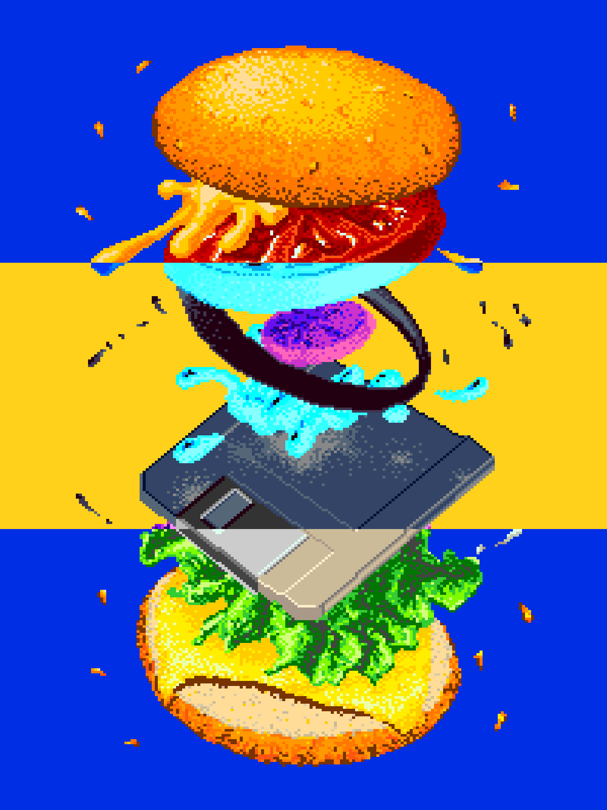

```{r}
#| include: false

library(dplyr)
library(here)

here::i_am("pinball_compliment_sandwich.qmd")

extrafont::font_import(pattern = "QuattrocentoSans", 
                       prompt = FALSE)
extrafont::loadfonts(device = "win")

# ggplot2::theme_set(theme_minimal() +
#                      theme(text = element_text(size = 15,
#                                                family = "Quattrocento Sans")))
options(knitr.table.html.attr = "quarto-disable-processing=true")

inline <- list()
```

```{r}
make_row <- function(row_item) {
  image_elements <- 
    if (any(names(row_item) == "overlay")) {
      glue::glue("
                 ")
    } else {
      glue::glue("")
    }
  
  glue::glue(
    "<section class='row'>
    <div class='column left'>
      <h2>{row_item$header}</h2>
      <p>{row_item$text}</p>
    </div>
    <div class='column right image-container'>
      {image_elements}
    </div>
  </section>"
  )
}

make_scroller <- function(row_list) {
  row_list %>%
    lapply(FUN = make_row) %>%
    paste0(collapse = "\n") %>% 
    paste("```{=html}\n",
          "<article class='scroller'>\n",
           .,
           "\n</article>\n",
          "```") %>%
    cat()
}
```

[{height="600"}](https://www.youtube.com/watch?v=i4EFkspO5p4)

# Transformers: More Than Meets the Eye

```{r}
#| results: asis

transformers_mtmte <- 
  list(
    list(header   = "A shot behind drops",
         text     = "Put more things behind drop targets! It adds variety, makes that shot conditionally dangerous, and gives a 'dirty pool' opportunity. The only time I can think of where I really bounced off it was Halloween, and I kind of think it's because it interfered with the main shot and made the game feel like a slog. I enjoy it here, even if the danger spills over to the adjacent center spinner and right ramp a little when they're up.",
         underlay = "https://site-assets.plasmic.app/445ddbfb260eb9616ed4f6c855f05507.webp",
         overlay  = "/images/transformers_drops.png",
         image_alt = "Transformers premium playfield, arrow with a flat head pointing to the drop targets"),
    list(header = "Center spinner/orbit",
         text   = "This one just doesn't feel satisfying. It looks similar to Godzilla's center shot, but my guess at what sets it apart is that it's less angled, it's more cramped with the drops intruding on the right side, and hitting it from the right side has a dangerous exit to the center.<br><br>This is more of a complaint than a criticism but it just doesn't bring me joy.",
         underlay = "https://site-assets.plasmic.app/445ddbfb260eb9616ed4f6c855f05507.webp",
         overlay  = "/images/transformers_center_spinner.png",
         image_alt = "Transformers premium playfield, highlighting the center spinner that feeds the right orbit and upper flipper"),
    list(header = "Dead end upper flipper shot",
         text   = "But this brings me lots of joy. Dead ends shots are some of my favorites because they're fast, they can fill gaps in the layout, and they kind of break the visual expectation of a ball path. The up-post turns it into a conditional holding point, which I also love because it's fast and not a scoop.",
         underlay  = "https://site-assets.plasmic.app/445ddbfb260eb9616ed4f6c855f05507.webp",
         overlay = "/images/transformers_dead_end.png",
         image_alt = "Pokemon Premium playfield, the ball circled")
  )

make_scroller(transformers_mtmte)
```

# Pokemon

```{r}
#| results: asis

pokemon <- 
  list(
    list(header   = "Dan Langlois Fan Club",
         text     = "Every Jack Danger game needs a nod to Dan Langlois, one of his favorite designers (mine too), and this one is in the direction of Bally Game Show.<br><br>It's less clear than Foo Fighters' inlane targets--self-intersecting ramps show up in Nordman's Wheel of Fortune and Gomez' Transformers--but there are cathedrals everywhere for those with the eyes to see.",
         underlay = "https://sternpinball.com/wp-content/uploads/2026/02/PokePremiumTop-scaled.jpg",
         overlay  = "/images/pokemon_crossover.png",
         image_alt = "Pokemon Premium playfield, the Pokeball/Squirtle ramp highlighted"),
    list(header = "The layout is...restrained",
         text   = "Compared to his previous 2 cornerstones (and even JP home) this game doesn't stand out. Uncanny X-Men was almost disorienting in the first video, even fanatics had to bring out their marlinspikes to unlay the ballpaths that sometimes turned back down the playfield.<br><br>This is standard. I understand the purpose and it's probably a good business decision to make something simple to bring in a new audience with this IP (even though I think the claims that this code is more understandable for non-pinball players are wrong). I just wanted to see something more surprising.",
         image = "https://sternpinball.com/wp-content/uploads/2026/02/PokePremiumTop-scaled.jpg",
         image_alt = "Pokemon Premium playfield"),
    list(header = "Wiggling ball mech",
         text   = "I love the small details that demonstrate the deep understanding and love a design team has for the theme. This doesn't add anything to the layout, but it was such a memorable part of the playing the game as a kid, seeing the ball wiggle and holding my breath for the third time, maybe even tapping A at *just* the right time to get an advantage we weren't sure was even real.<br><br>This was a great use of the BoM.",
         underlay  = "https://sternpinball.com/wp-content/uploads/2026/02/PokePremiumTop-scaled.jpg",
         overlay = "/images/pokemon_ball.png",
         image_alt = "Pokemon Premium playfield, the ball circled")
  )

make_scroller(pokemon)
```

# Star Wars: Fall of the Empire

```{r}
#| results: asis

star_wars_fote <- 
  list(
    list(header   = "Double spinner orbits",
         text     = "As much as I crave wacky elements and unexpected ball paths, I'm in love with unsexy fundamentals done well. Chicken soup, public transit, a full orbit with double spinners. It always looks both bland and excessive to me on paper, but this is satisfying. I haven't played enough FOTE to get that Fade to Black feeling from them yet, but it'll get there.<br><br>I'll go a little farther and say, this whole game looked boring to me before I played but it's solid and the code is great.",
         underlay = "https://site-assets.plasmic.app/bb7ba6a5e7fb31705e6b0eb01757de76.webp",
         overlay  = "/images/star_wars_fote_spinners.png",
         image_alt = "Star Wars FOTE, outer loop with both spinners circled"),
    list(header = "Vader scoop",
         text   = "Borg's previous (non-remake) Rush had one of my favorite middle thirds (second quarters? whatever's above the inlanes) in a recent game with the lock behind drops on the left. FOTE has the fun pops but the scoop is plopped down like it fell off an ice cream cone. It's not bad and it's helpful to have a holding element (that isn't super hard, Death Star lock), but I'm just not feeling it.",
         underlay = "https://site-assets.plasmic.app/bb7ba6a5e7fb31705e6b0eb01757de76.webp",
         overlay  = "/images/star_wars_fote_vader_scoop.png",
         image_alt = "Star Wars FOTE, Vader scoop on the lower right circled"),
    list(header = "Jedi ball save",
         text   = "I'm starting to think physical ball saves are the new trend above physical locks. Of course, Jack Danger's deadpost is my favorite, but Jaws had a throwback outlane bump post (and Kong gave you a similar opportunity), and now this magnet save. It's not entirely new, Spooky used it in Alice Cooper and again in Beetlejuice, but I don't think I've seen the left outlane save into the shooter lane and it feels great. I wonder what will be next, a gate like Argosy? Yes, please.",
         underlay  = "https://site-assets.plasmic.app/bb7ba6a5e7fb31705e6b0eb01757de76.webp",
         overlay = "/images/star_wars_fote_jedi_save.png",
         image_alt = "Star Wars FOTE, ball path from left outlane to inlane via Jedi magnet")
  )

make_scroller(star_wars_fote)
```
