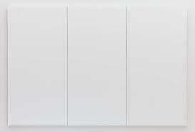
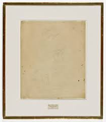
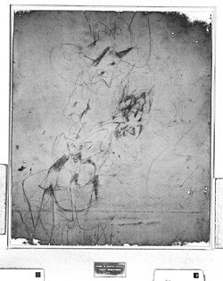
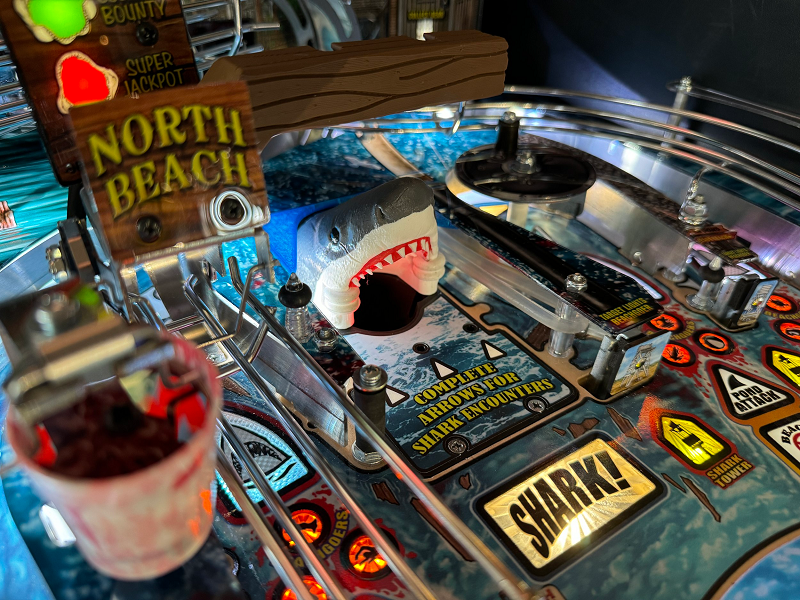
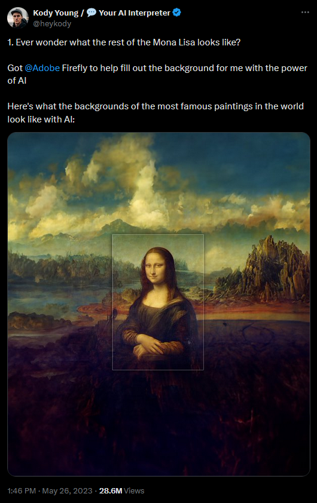
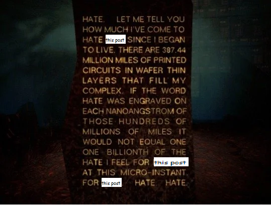

# *Erased de Kooning Drawing, 1953*

In 1953 Robert Rauschenberg had just finished a series of all-white canvases, the kind of thing that makes steam come out verified Twitter users' ears, and he started thinking about how to draw nothing. He tried erasing his own drawings, but wasn't satisfied with that because his original "wasn't art yet". So he asked another artist, Willem de Kooning, almost twice his age, respected in the art establishment, someone whose work would be "indisputably considered art", for a drawing he could erase. Rauschenberg spent a careful month or two removing as much of the ink, charcoal, and grease pencil marks as he could. What's left is only slightly more structured than a smudge.

# *SFMOMA Rauschenberg Research Project: Conservation Document, 2010* 

But who cares? It's 2024 grandpa, of course erasing art is also art. There are 3 copies of Duchamps' *Fountain (1917)* in every men's bathroom. I'm not so interested in *Erased de Kooning* as much as I am in a related piece from SFMOMA's Elise S. Haas Conservation Studio with Robin Myers, an imaging and color specialist.

They used an infrared-passing filter, Photoshop, and painstaking corrections for "non-uniformity of the lighting, the cosine-fourth falloff from the lens, and the sensor calibration variance" to **un-erase the original de Kooning drawing**.

That's really cool why do I hate it so much?

# *Jaws the Ball-Eater, 2024*

Even though I followed the 'why no shark eat ball?' talk and I think I've internalized that Pinsiders are more complainers than critics, I thought they would...you know...play the game and react to it. But no, a bunch of people were content to say baseless and silly things like 'Stern cheaped out' or 'the team couldn't make it work'. It became enough of a thing that Keith and the team talked about it, turns out it just wasn't right for this game. 

::: {.column-margin}
This isn't even the first time it's happened to Keith, when Iron Maiden released, I saw posts on Pinside about how Stern forced him to remove the vari-target from his Archer homebrew to cut costs. It got enough attention that Sk8ball himself reached into that garbage disposal to manually relieve the obstruction. It just wasn't a good fit in the final game.
:::

But, five days after Stern announced the game, a mod-maker posted the thread "Jaws the Ball Eater" that *validated* these complaints and even gave them a *solution*, replacing the shark bash toy with a hole and a VUK to the right ramp.

# *Rest of the Mona Lisa, 2023*

In late May 2023, a project manager for Adobe Firefly posted an example of using that company's generative image algorithms on a canvas with a small central image. *Starry Night* as "larger format" with "the original work...at the center". Another user, Kody Young (\@heykody), copied the idea with the *Mona Lisa* and described it with a phrase that still causes me massive psychic damage.

# What isn't there isn't missing

The rest??!! Like there's some true uncropped version that's lost and needs to be recovered and only AI, this meat grinder of stolen creative works, knows what that is. According to Kody, it's not an an idea or a curiosity, it's the *way it should have always been*. We've forgotten the truth, but the machine remembers. 

What is this desire to 'restore' art to some state it was never intended to be in? 

The point of *Erased de Kooning Drawing* was to obliterate something, to take a work that existed and had credibility and make it gone, then show off how gone it is. I don't know if Myers and team intended to participate in the intent of the original work, the interviews and writeups I read didn't seem to wink at the idea, and when I first read that paper I saw it as a technical problem solved out of curiosity. I was even a little mad that they tampered with a work of art, but I probably would have felt the same way in 1953. Now I can't see it as anything other than judo-flipping Rauchenberg.

I don't feel the same way about the ball-eating shark mod. It conflicts with the goal of the design, but doesn't comment on it. Keith Elwin has acknowledged the tendency for modern games to be too safe--sharp shooting consistently returns the ball to a flipper and you just do it again. Jaws is a comment about the state of the hobby. It puts important features behind dangerous shots--the encounters and their bonuses are behind the boat captive ball and shark bash toy, the fish finder awards only come from a side-flipper shot into a bank of drops, and the central toy is a moving drop target that's so drainy one of the power-ups is a ball save *specifically for hitting it*.

The mod takes some of that danger away. It replaces the central shark bash toy with a hole and a VUK that returns to the right ramp and drops the ball off...safely at the right flipper.

The un-erased de Kooning and the Jaws mod are not doing anything that awful. I genuinely believe they miss the point, but they also show knowledge and craft and care. And they provoke something in me, make me think about the original works and about what it means to modify art, and how that's different for art forms like pinball that are physically changed not just copied.

My criticism about this mod is less about people making it and more about the people *asking for* it, because I don't think they're engaging with the art, they're just demanding to see the rest of the *Mona Lisa*. Generative AI is enabling the illogical conclusion of that behavior, where people can completely disengage from a work that's surprising and challenging and frustrating because they can get an endless stream of things they already like baby-birded directly into their mouths. I'm not so afraid of generative AI getting to the point where it can make passable movies based on prompts like "Wes Anderson's Star Wars", but I am afraid that people will *want* that. 

Cause what's the point of art that's made to your exact specifications? That's something I don't understand about this drive to use generative AI for creative tasks; it's designed to sample from a probability distribution that's consistent with the training data, but that's the opposite of what I want. I want things I wouldn't have asked for because I never would have thought to ask for them.